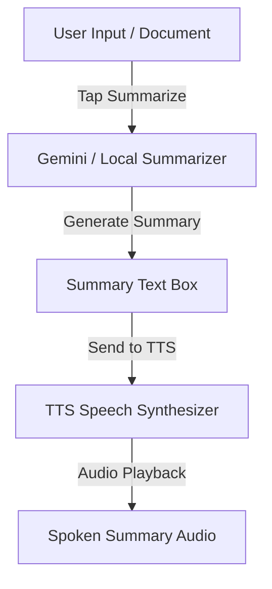

# Sonify: Advanced Feature Suggestions (UX, Audio, & AI)

This document outlines a roadmap of high-impact features that can be implemented in the Sonify TTS application. These features are categorized into **User Experience (UX) Enhancements**, **Sound & Audio features**, and **AI & Speech Intelligence features**.

---

## 1. User Experience (UX) Enhancements

Enhancing the interface and interaction flow makes the text-to-speech reading experience more natural, accessible, and productive.

### 1.1. Synchronized Text Highlighting (Karaoke Mode)
* **Description**: As the TTS engine reads the text, the corresponding word, sentence, or line is highlighted in real-time.
* **Why it's important**: Improves comprehension, assists users with reading challenges (like dyslexia), and helps the user stay oriented in long documents.
* **Technical Implementation**:
  * Piper TTS and native engines can emit word-level timestamps (boundaries) indicating the start time and duration of each spoken word.
  * In Flutter, use a `RichText` widget with custom `TextSpan` elements that update dynamically based on the current character index/offset emitted by the TTS engine.
* **Flow**:


### 1.2. Document Scanning & OCR Reader (Camera to Voice)
* **Description**: Users scan physical book pages, documents, or labels using their device's camera, extract the text, and read it out loud.
* **Why it's important**: Bridges the gap between physical media and digital audio accessibility.
* **Technical Implementation**:
  * Use [google_mlkit_text_recognition](https://pub.dev/packages/google_mlkit_text_recognition) for fast, free, fully offline OCR processing.
  * Use [camera](https://pub.dev/packages/camera) or [image_picker](https://pub.dev/packages/image_picker) to capture the image.
  * Auto-clean the extracted text (remove double spaces, fix linebreaks) before loading it into the TTS input field.

### 1.3. Smart Web Article Reader (URL to Speech)
* **Description**: Users input a web link, and the app extracts the primary article body (stripping out sidebars, ads, headers, and footer comments) to read it cleanly.
* **Why it's important**: Converts long web articles, news, and blogs into personalized podcasts.
* **Technical Implementation**:
  * Use an HTTP client (like `http` or `dio`) to fetch the HTML.
  * Parse HTML with [html](https://pub.dev/packages/html) or use a text-extraction algorithm/service (such as a local Readability-based parser) to isolate the article content.

### 1.4. Sleep Timer with Audio Fade-Out
* **Description**: A timer that stops playback after a user-defined duration (e.g., 15, 30, or 60 minutes) or at the end of the current paragraph/chapter.
* **Why it's important**: Many users listen to spoken-word audio while falling asleep.
* **Technical Implementation**:
  * Use a Dart `Timer` to countdown.
  * To prevent an abrupt stop, implement a "Fade-out" period where `just_audio`'s volume is linearly decreased from `1.0` to `0.0` over the final 30 seconds before pausing.

---

## 2. Sound & Audio Enhancements

Adding multi-track layering, rich spatial controls, and system-level audio integrations makes Sonify feel like a native audio player.

### 2.1. Ambient Soundscape Mixer (Multi-track Layering)
* **Description**: Allows users to blend soft background noises (e.g., lofi beats, gentle rain, white/pink noise, forest rustles) underneath the synthesized TTS voice.
* **Why it's important**: Increases user focus, reduces listening fatigue, and masks disruptive environmental sounds.
* **Technical Implementation**:
  * Use [just_audio](https://pub.dev/packages/just_audio)'s concurrent player instances (one for TTS speech audio, another looping player for the background soundscape).
  * Provide a dual-slider UI to let users customize the relative volume of the voice vs. the background environment.
* **Aesthetic UX mockup layout**:
```
+------------------------------------------+
|  [Voice Volume] --------O-------------   |  (Volume: 80%)
|  [Rain Sound]    ---O-----------------   |  (Volume: 20%)
|  [Lofi Beats]    ---------------------   |  (Volume: 0%)
+------------------------------------------+
```

### 2.2. Background Playback & OS Media Controls
* **Description**: Audio continues playing when the screen is locked or when switching to other apps, complete with operating system media controls (Play, Pause, Skip) in the notification bar and lock screen.
* **Why it's important**: Essential for eyes-free listening on the go (e.g., while walking, driving, or working).
* **Technical Implementation**:
  * Use [audio_service](https://pub.dev/packages/audio_service) alongside `just_audio` to manage OS-level background playback audio sessions.
  * Map player states to system buttons, enabling bluetooth headphone keys to play/pause the reading session.

### 2.3. Subtle Micro-Acoustic Feedback (SFX & Haptics)
* **Description**: Low-frequency, tactile clicks, and high-fidelity sound cues that accompany primary actions (e.g., a soft sweep sound when a conversion is completed, or a satisfying tick when toggling a bookmark).
* **Why it's important**: Reinforces user actions with pleasant feedback, raising the premium feel of the app's interactive elements.
* **Technical Implementation**:
  * Preload brief SFX files (.wav or .mp3) using a lightweight sound manager.
  * Use `HapticFeedback` from Flutter's services library to trigger coordinated light vibrations.

---

## 3. AI & Speech Intelligence Enhancements

Leveraging on-device and cloud AI elevates Sonify from a simple TTS engine into a fully smart reading assistant.

### 3.1. Local AI Document Summarizer
* **Description**: Summarizes long text inputs, PDFs, or scanned documents into key bullet points or a concise paragraph before reading.
* **Why it's important**: Saves time by allowing users to check the core concepts before listening to the full document.
* **Technical Implementation**:
  * Integrate on-device LLMs (such as **Gemini Nano** on supported Android/iOS devices via Google's AI Edge SDK).
  * Alternatively, implement an integration with the **Gemini API** using [google_generative_ai](https://pub.dev/packages/google_generative_ai) for cloud-based summaries.
* **Workflow**:


### 3.2. Sentiment-Driven Speech Modulation (Emotional Voice)
* **Description**: The AI analyzes the emotional context or tone of the text (e.g., happy, solemn, urgent, instructional) and dynamically adapts the voice pitch, rate, and style to match.
* **Why it's important**: Makes voices sound less robotic, more natural, and more immersive.
* **Technical Implementation**:
  * Use a local lightweight classification model (or an API call) to analyze the text paragraphs for sentiment.
  * Map sentiment outputs to TTS parameters (e.g., *Excited* -> slightly faster rate, higher pitch; *Solemn* -> slower rate, lower pitch, longer pauses at punctuation).

### 3.3. AI Reading Assistant (Document Q&A Chat)
* **Description**: Users can ask natural language questions about the document they are currently reading (e.g., "What was the author's argument on page 3?").
* **Why it's important**: Turns reading from a passive listening task into an active, interactive learning session.
* **Technical Implementation**:
  * Store the text chunks in a local vector database or simple memory buffer.
  * Feed the context along with the user's audio-inputted question to Gemini to synthesize a concise spoken answer.

### 3.4. Auto-Language & Voice Router
* **Description**: Automatically detects the language of the pasted text (e.g., Spanish, French, Japanese) and switches to the correct language model voice automatically.
* **Why it's important**: Prevents users from hearing foreign text read with an incorrect, highly accented English pronunciation.
* **Technical Implementation**:
  * Use an on-device language detector model (like Google ML Kit Language ID).
  * Swap active models or voice configurations in `TTSEngine` dynamically based on the detected language code.

---

## Suggested Implementation Sequence

We recommend implementing these features in waves, building upon the foundations set in the core phases:

```
                  +-----------------------------------+
                  |  Wave 1: Advanced UX & Audio      |
                  |  - Synchronized Text Highlighting |
                  |  - Background Audio Service       |
                  |  - Sleep Timer with Fade-out      |
                  +-----------------+-----------------+
                                    |
                                    v
                  +-----------------+-----------------+
                  |  Wave 2: Media & Scanners         |
                  |  - OCR Page Document Scanner      |
                  |  - Ambient Soundscape Mixer       |
                  |  - Web URL Article Reader         |
                  +-----------------+-----------------+
                                    |
                                    v
                  +-----------------+-----------------+
                  |  Wave 3: Speech AI Intelligence   |
                  |  - On-Device Gemini Summarizer    |
                  |  - Sentiment Speech Modulator     |
                  |  - Document Q&A Assistant         |
                  +-----------------------------------+
```
